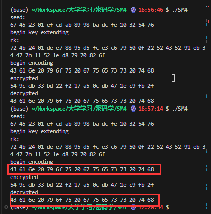

# SM4

## SM4算法特征

在随着网络安全问题越来越受到关注的今天，选择一个既安全又高效的加密算法至关重要。SM4算法作为我国自主研发的对称加密标准，在此背景下显得尤为重要。SM4算法的关键特征如下。

1. SM4简介

   SM4算法，原名“SMS4”，是中国国家密码管理局于2006年发布的一个用于无线局域网络安全的块密码算法，也被广泛用于其他领域。它使用了128位的固定块大小和128位的密钥长度。

2. SM4特征

   **固定参数：**SM4算法使用固定大小的块（128位）和密钥长度（128位）

   **对称结构：**为一个块密码算法，SM4的加密和解密过程非常相似，只是轮密钥的使用顺序不同。

   **S盒**: SM4使用了一个特定的8位输入/输出S盒来进行非线性字节替换，增强其安全性。

   **轮数**: 算法通过32轮的加密过程来确保数据的安全性。

   **轮函数**: 每一轮都使用一个复杂的轮函数，结合了线性和非线性运算来处理数据。

## SM4算法原理

### 加密算法

SM4密码算法是一个分组算法。数据分组长度为128比特，密钥长度为128比特。加密算法采用32轮迭代结构，每轮使用一个轮密钥。
设输入明文为(X0，X1，X2，X3)，四个字，共128位。输入轮密钥为RKi，i＝0,1,…,31，共32个字。输出密文为(Y0，Y1，Y2，Y3)，四个字，128位。加密算法可描述如下:
$$
X_{i+4}=F(X_i,X_{i+1},X_{i+2},X_{i+3},RK_i)
$$
为了与解密算法需要的顺序一致，在加密后还需要进行反序处理R
$$
R(Y_0,Y_1,Y_2,Y_3)=(X_{35},X_{34},X_{33},X_{32})
$$


### 解密算法

SM4算法的解密变换与加密变换结构相同，不同的仅是轮密钥的使用顺序，解密时使用轮密钥序(rk31,rk30,···,rk0)。
$$
X=F(X_{i+4},X_{i+3},X_{i+2},X_{i+1},RK_i)
$$
同样，解密之后也需要反序处理R
$$
R(M_0,M_1,M_2,M_3)=(X_{3},X_{2},X_{1},X_{0})
$$


### 密钥扩展算法

设输入的加密密钥为MK，输出轮密钥为RK，中间数据为K，密钥扩展算法如下
$$
(K_0,K_1,K_2,K_3)=(MK_0\oplus FK_0,MK_1\oplus FK_1,MK_2\oplus FK_2,MK_3\oplus FK_3)
$$

$$
RK=K_i\oplus T'(K_{i+1},K_{i+2},K_{i+3},CK_{i})
$$

## 编程实现

### 主要常量

```c
// S-box table for SM4
const uint8_t Sbox[256] = {
	0xd6,0x90,0xe9,0xfe,0xcc,0xe1,0x3d,0xb7,0x16,0xb6,0x14,0xc2,0x28,0xfb,0x2c,0x05,
	0x2b,0x67,0x9a,0x76,0x2a,0xbe,0x04,0xc3,0xaa,0x44,0x13,0x26,0x49,0x86,0x06,0x99,
	0x9c,0x42,0x50,0xf4,0x91,0xef,0x98,0x7a,0x33,0x54,0x0b,0x43,0xed,0xcf,0xac,0x62,
	0xe4,0xb3,0x1c,0xa9,0xc9,0x08,0xe8,0x95,0x80,0xdf,0x94,0xfa,0x75,0x8f,0x3f,0xa6,
	0x47,0x07,0xa7,0xfc,0xf3,0x73,0x17,0xba,0x83,0x59,0x3c,0x19,0xe6,0x85,0x4f,0xa8,
	0x68,0x6b,0x81,0xb2,0x71,0x64,0xda,0x8b,0xf8,0xeb,0x0f,0x4b,0x70,0x56,0x9d,0x35,
	0x1e,0x24,0x0e,0x5e,0x63,0x58,0xd1,0xa2,0x25,0x22,0x7c,0x3b,0x01,0x21,0x78,0x87,
	0xd4,0x00,0x46,0x57,0x9f,0xd3,0x27,0x52,0x4c,0x36,0x02,0xe7,0xa0,0xc4,0xc8,0x9e,
	0xea,0xbf,0x8a,0xd2,0x40,0xc7,0x38,0xb5,0xa3,0xf7,0xf2,0xce,0xf9,0x61,0x15,0xa1,
	0xe0,0xae,0x5d,0xa4,0x9b,0x34,0x1a,0x55,0xad,0x93,0x32,0x30,0xf5,0x8c,0xb1,0xe3,
	0x1d,0xf6,0xe2,0x2e,0x82,0x66,0xca,0x60,0xc0,0x29,0x23,0xab,0x0d,0x53,0x4e,0x6f,
	0xd5,0xdb,0x37,0x45,0xde,0xfd,0x8e,0x2f,0x03,0xff,0x6a,0x72,0x6d,0x6c,0x5b,0x51,
	0x8d,0x1b,0xaf,0x92,0xbb,0xdd,0xbc,0x7f,0x11,0xd9,0x5c,0x41,0x1f,0x10,0x5a,0xd8,
	0x0a,0xc1,0x31,0x88,0xa5,0xcd,0x7b,0xbd,0x2d,0x74,0xd0,0x12,0xb8,0xe5,0xb4,0xb0,
	0x89,0x69,0x97,0x4a,0x0c,0x96,0x77,0x7e,0x65,0xb9,0xf1,0x09,0xc5,0x6e,0xc6,0x84,
	0x18,0xf0,0x7d,0xec,0x3a,0xdc,0x4d,0x20,0x79,0xee,0x5f,0x3e,0xd7,0xcb,0x39,0x48
};
// System parameter CK for key extension
const uint32_t CK[32] = {
    0x00070e15,0x1c232a31,0x383f464d,0x545b6269,
    0x70777e85,0x8c939aa1,0xa8afb6bd,0xc4cbd2d9,
    0xe0e7eef5,0xfc030a11,0x181f262d,0x343b4249,
    0x50575e65,0x6c737a81,0x888f969d,0xa4abb2b9,
    0xc0c7ced5,0xdce3eaf1,0xf8ff060d,0x141b2229,
    0x30373e45,0x4c535a61,0x686f767d,0x848b9299,
    0xa0a7aeb5,0xbcc3cad1,0xd8dfe6ed,0xf4fb0209,
    0x10171e25,0x2c333a41,0x484f565d,0x646b7279
};
```

### 主要函数

#### 函数

```c
// Substitution in the SM4 S-box
uint32_t tauTran(const uint32_t x);
// Linear transformation L in SM4
uint32_t LTran(const uint32_t x);
// Combined Tau and L transformation
uint32_t TTran(const uint32_t x);
// Non-linear function F in SM4
uint32_t FTran(const uint32_t x0, const uint32_t x1, const uint32_t x2, const uint32_t x3, const uint32_t rk);
// reverse an array of uint32_t
void reverse(uint32_t *bytes, size_t len);
// Key extension to compute round keys from master key
void keyExpansion(const uint32_t *mk, uint32_t *k);
// SM4 encryption of 128-bits block
void encrypt(const uint32_t *plaintext, const uint32_t *rk, uint32_t *ciphertext);
// SM4 decryption of 128-bits block
void decrypt(const uint32_t *ciphertext, const uint32_t *rk, uint32_t *plaintext);
```

#### τ运算

```c
// Substitution in the SM4 S-box
uint32_t tauTran(const uint32_t x){
    return Sbox[x >> 0 & 0xff] << 0 | Sbox[x >> 8 & 0xff] << 8 |
        Sbox[x >> 16 & 0xff] << 16 | Sbox[x >> 24 & 0xff] << 24;
}
```

#### L运算

```c
// Linear transformation L in SM4
uint32_t LTran(const uint32_t x){
    return x ^ left_shift(x, 2) ^ left_shift(x, 10) ^ left_shift(x, 18) ^ left_shift(x, 24);
}
```

#### T运算

```c
// Combined Tau and L transformation
uint32_t TTran(const uint32_t x){
    return LTran(tauTran(x));
}
```

#### F运算

```c
// Non-linear function F in SM4
uint32_t FTran(const uint32_t x0, const uint32_t x1, const uint32_t x2, const uint32_t x3, const uint32_t rk){
    return x0 ^ TTran(x1 ^ x2 ^ x3 ^ rk);
}
```

#### 扩展密钥

```c
// Key extension to compute round keys from master key
void keyExpansion(const uint32_t *mk, uint32_t *k){
    for(int i=0;i<4;++i){
        k[i] = mk[i] ^ CK[i];
    }
    for(int i=4;i<32;++i){
        k[i] = k[i-4] ^ TTran(k[i-1] ^ k[i-2] ^ k[i-3] ^ CK[i]);
    }
}
```

#### 加密

```c
// SM4 encryption of 128-bits block
void encrypt(const uint32_t *plaintext, const uint32_t *rk, uint32_t *ciphertext){
    uint32_t x[36] = { 0 };
    memcpy(x,plaintext,4*sizeof(uint32_t));
    for(int i=0;i<32;i++){
        x[i+4] = FTran(x[i],x[i+1],x[i+2],x[i+3],rk[i]);
    }
    memcpy(ciphertext,x+32,4*sizeof(uint32_t));
    reverse(ciphertext, 4);
}
```

#### 解密

```c
// SM4 decryption of 128-bits block
void decrypt(const uint32_t *ciphertext, const uint32_t *rk, uint32_t *plaintext){
    uint32_t x[36] = { 0 };
    memcpy(x,ciphertext,4*sizeof(uint32_t));
    for(int i=0;i<32;i++){
        x[i+4] = FTran(x[i],x[i+1],x[i+2],x[i+3],rk[31-i]);
    }
    memcpy(plaintext,x+32,4*sizeof(uint32_t));
    reverse(plaintext, 4);
}
```

#### main函数

```c
int main(){
    const size_t bufferSize = 16;  // Read in chunks of 16 Bytes
    uint8_t plaintext[] = {0x43, 0x61, 0x6e, 0x20, 0x79, 0x6f, 0x75, 0x20, 0x67, 0x75, 0x65, 0x73, 0x73, 0x20, 0x74, 0x68};
    uint8_t encodetext[bufferSize];
    size_t bytesRead;

    puts("seed:");
    printBytes(mk, 16);

    // Key extension process
    puts("begin key extending");
    keyExpansion(mk, rk);
    puts("rk:");
    printBytes(rk, 32);

    // Encryption process
    puts("begin encoding");
    printBytes(plaintext, bufferSize);
    encrypt((uint32_t*)plaintext, rk, (uint32_t*)encodetext);
    puts("encrypted");
    printBytes(encodetext, bufferSize);

    // Decryption process
    memset(plaintext, 0, bufferSize);
    decrypt((uint32_t*)encodetext, rk, (uint32_t*)plaintext);
    puts("decrypted");
    printBytes(plaintext, bufferSize);
    
    return 0;
}
```

### 编译参数

```makefile
all:
	@cc \
		-std=c99 -pedantic \
		-Wall -Wextra \
		-O2 -funroll-loops \
		SM4.c \
		op.c \
		-o SM4
```


### 运行结果



发现解密结果与明文相同，验证了其有效性，完整项目已上传github，